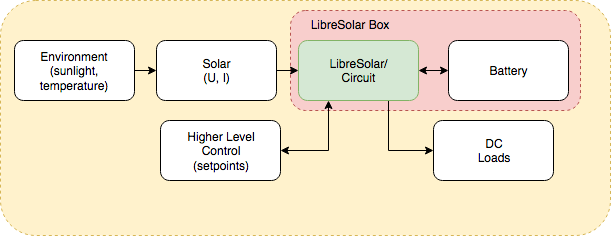
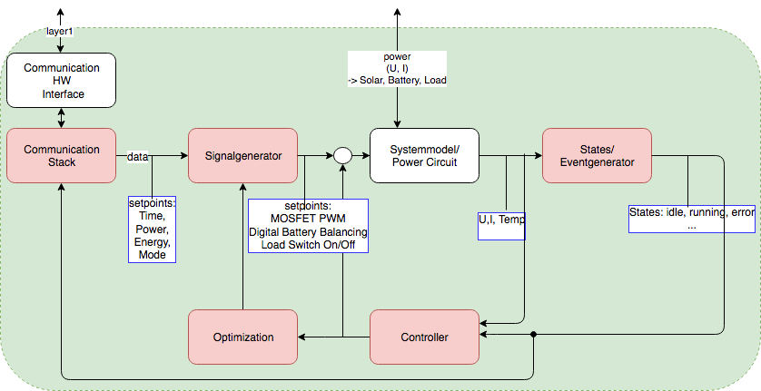
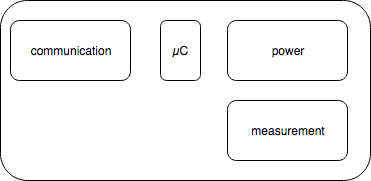

# LibreSolar System Simulation

Modelling and simulation of LibreSolar components and needed external components like solarpanels and battery cells to analyse the behaviour of the system

## System overview

##### Environment Generator:
function: Generates system parameter which influence the LibreSolar Box Components out of given values from the location profile

- Location Profile (city/geo_position, season, daytime)
- irradience [W/m^2], temperature [celsius]

##### Solar:
- irradience [W/m^2]
- temperature [celsius]
- type (type [mono/poly/...], surface [m^2], nominal_values (Wp, V, I))
- --> alternative: data_sheet parameter -> nominal_values 
- voltage[V], current [I]

##### Battery:
- type (...), nominal_values (capacity [Ah], voltage [V]), security_values/MinMax Value (...)
- Box Temp.
- voltage[V], current [I]
- SOC, SOH
- temperature [celsius]

##### Loads:
- time_using [h]
- voltage [V], current [I]
- //open question: does the Load System effects with V or I the Libre Solar System

LibreSolar (electronics):
- solar_voltage [V], solar_current [I]
- output - voltage[V], current[I],
- Box Temp. [celsius]
- comm_data (modi (used panels+batteries, system parameter settings -> needed voltage, power, energy)))

## Control Model

##### Communication Interface/ Stack:
HW: circuit for signal voltage level to 
Communication Parameters from Higher Control Level
-> Server
(-> Selfmanaged)
-> mobile Application
-> Grid Application

##### Signal Generator:
- MPPT Charger algorithm
- BMS algorithm

##### Systemmodel/Power Circuit:
- Power component -> Interface between µC and Energy HW (Solar, Batteries) -> Output1
- measurement component (scaled U, I) -> Output2

##### Event Generator:
- system states and 

## Hardware Model

